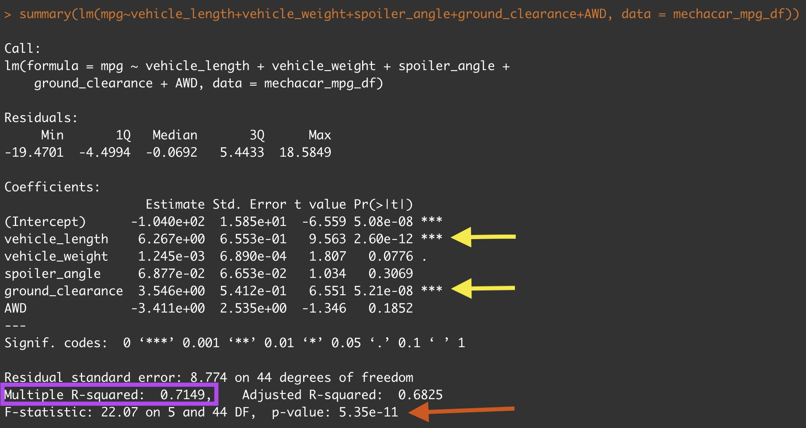

# MechaCar Statistical Analysis
Statisitical analysis of automobile performance with R

## Overview
AutosRUs' new MechaCar is "suffering from production troubles" and the company is hoping that an analytical review may help provide some insight. The goal of this project is to:
* discover which variables predict the MPG for vehicle prototypes;
* collect summary stats on the PSI of suspension coils;
* determine if manufacturing lots are statistically different from the mean population;
* design a study to compare the MechaCar performance against vehicles from other manufacturers.

## Results

## Linear Regression to Predict MPG

The most significant variables effecting the MPG of the MechaCar are the **Vehicle Length** and the **Ground Clearance**. As indicated in the image above, a linear regression model run on these variables against figures for MPG, resulted in p-values of 2.6x10-12 and 5.21x10-8, respectively.
Which variables/coefficients provided a non-random amount of variance to the mpg values in the dataset?

Is the slope of the linear model considered to be zero? Why or why not?

Does this linear model predict mpg of MechaCar prototypes effectively? Why or why not?

### Deliverable 2

### Deliverable 3

## Summary
